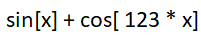
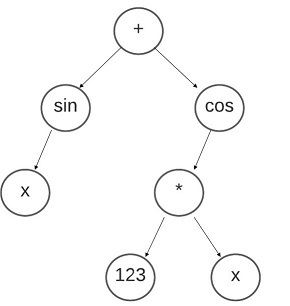
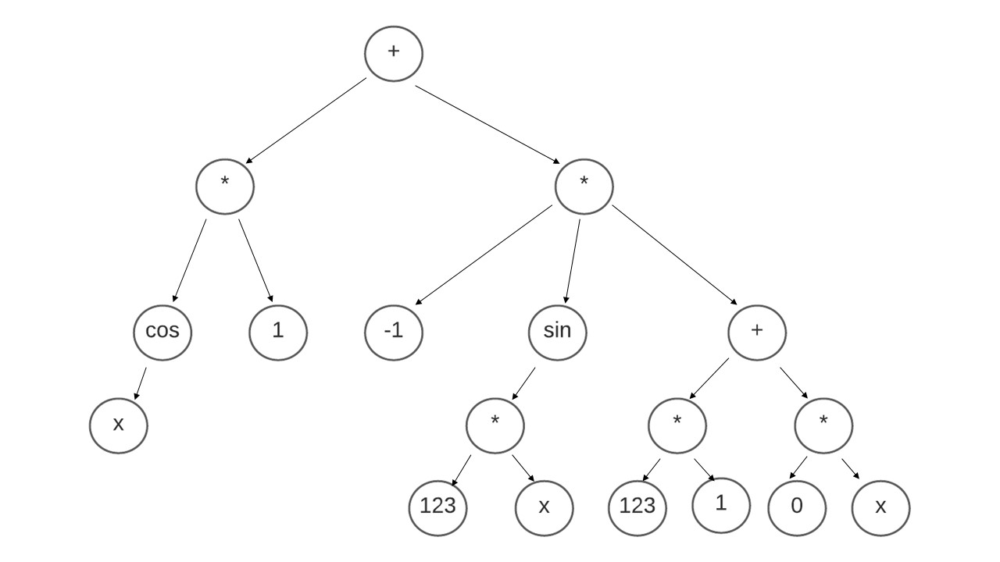

# Automated Derivate Computation

The derivative of numerous typical mathematical functions and their combinations can be calculated using this application. 
The input equations can have following standard mathematical functions:
1.	**Trigonometric Functions**- 
    - sinx, cosx, tanx, secx, cosecx, cotx
2.	**Logarithmic Functions**-
    - logx
3.	**Polynomial Functions**-
    - x^n + C
4.	**Exponential Functions**-
    - e^x , a^x
5. **Operations on these functions**-
    - Addition(+), Subtraction(-), Multiplication(*), power(^).
6. **Composite Functions** - Combination of above mentioned functions.  

### Example Input strings to try:
1. log[34 * sin[x]] + tan[sin[x] - 67] + 12
2. sin[cos[2 * x] + 12] + 123 * x
3. sin[x] + cos[x] + 123 * x
4. sec[4 * x] + tan[log[x] + 12] + 12

### How It Works?

Input - 

**1. Input String Parsing**-
   1. The input string is parsed based on "[]"(for Unary Functions) and " "(for Binary Operations) into a vector containg all the opeartors and operands in infix order.
   2. The operands for composite functions are still associated with the parent functions.
   
   **Functions used** - 
   `string removeSpaces(string str);`
   `vector<string> getOperands(string ip_string);` 

**2. Constructing The Expression Tree**-
        The input infix equation is converted into postfix form considering the precedence of operators by making use of the stack. An expression tree is constructed which can have two types of nodes- 
        -	*Operand Node* - If the operand is operand like numbers or ‘x’ then the node will have both of its child pointing to null values indicating there are no further children to this node.
        -	*Operator Node* - It the operator is binary like addition or subtraction then it’s right and left children will point towards the operands of the operator and if the operator is unary then its right child will point toward the operand node of the given operator.

   **Steps**-
   1. The parsed infix eqution is converted into postfix equation according to the operator precedance.
   **Functions used** - 
    `vector<string> infixToPost(vector<string> infix);`
    `vector<string> postfix(string in_string);`
   
   1. The postfix equation is converted into an expression tree by using stack.
   **Functions used** - 
   `node *operandNode(string str);`
   `node *constructTree(string eqn);`
   (the operandNode function is used to construct the tree for function's operand-composite functions-the operand also can be a function)

**3. Constructing The Derivative Tree**- 
The function used for constructing the derivative tree takes the root node of the expression tree and recursively finds the derivative of the left and right child. If the node is mathematical operator node then the program finds the derivative of left and right child recursively else if the node is operand then it maps the corresponding derivative of the function.
Traverse the expression tree starting from the root -> left node -> right node.
    **Functions used** - 
    `node *copyNode(node *Node);`
    `node *exponentDerivative(node *Node);`
    `node *findDerivative(node *Node);`

The procedure from string parsing is again repeated for the opearands of the composite functions. 

**4. Printing The Derivative Equation**-
The derivative tree is traversed starting from the root node and the functions are printed with valid parenthesis.
     **Functions used** - 
     `string traversal(node *root);`

#### Note - 
- There are numerous functions other than above mentioned that are used as utility functions and to maintain the flow of the program.

- Conventions to be followed while giving **custom input**: 
  - Enclose the operands of the unary functions in "[ ]" brackets. E.g. tan[x] (x enclosed in "[]")
  - The operands of the binary operators should be spaced. E.g. A + B (A"space"+"space"B )
  - All the standard functions should be spelled as - x, sin, cos, tan, sec, cosec, cot, log (case sensitive)
  - The equation can have number constants.
  - The variable name for the standard functions and operations should be x. E.g. x + log[x]

   
